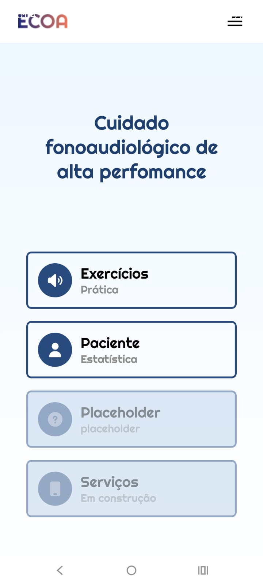
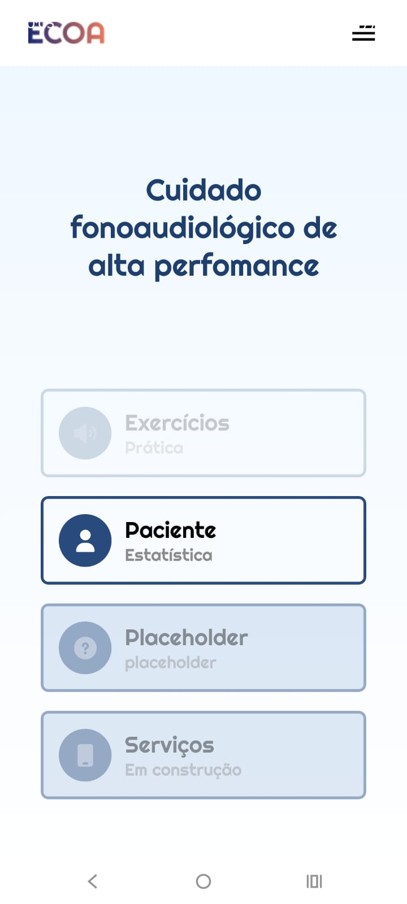
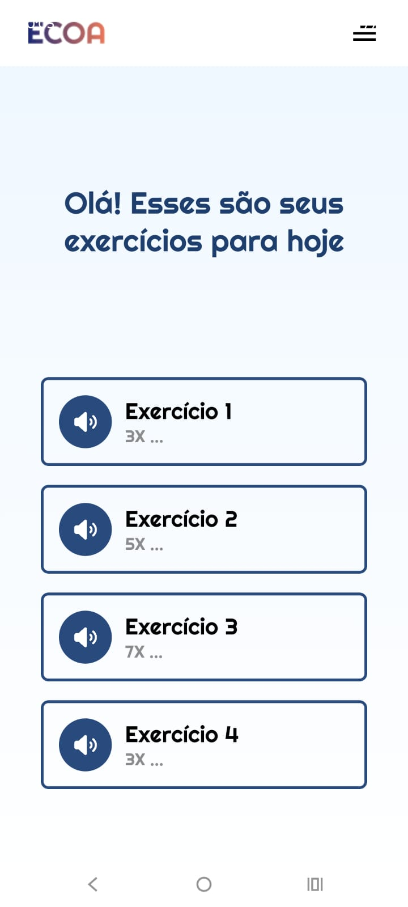
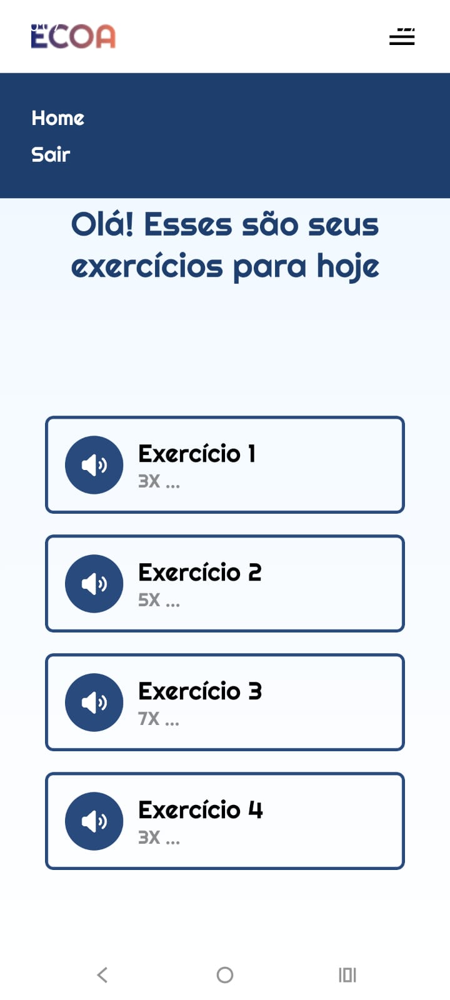

# Ecoa Fono

## Integrantes

* André de Sousa Neves – RM 553515
* Caio Sato Tominaga – RM 553633
* Eduardo Brites Coutinho – RM 552943
* Isabela Barcellos – RM 553746
* Thaís Gonçalves Leoncio – RM 553892

---

# Descrição do Projeto

O Ecoa é um Aplicativo desenvolvido para a disciplina de Mobile Development & IOT.

A aplicação foi criada com o objetivo de recomendar exercícios fonoaudiológicos personalizados com base na faixa etária e no objetivo do usuário, promovendo bem-estar, desenvolvimento da fala, comunicação e exercícios vocais.

---

# Objetivo

O objetivo do Ecoa é disponibilizar uma APP que oferece exercícios fonoaudiológicos personalizados. Dessa forma, o projeto aplica conceitos de Desenvolvimento Mobile utilizando o framework React Native, o que o deixa acessivel a qualquer umas das principais plataformas de Sistemas Operacionais Mobile

---

# Tecnologias Utilizadas

* TypeScript
* React Native
* Expo SDK

---

# Telas do projeto

<div style="display: flex; overflow-x: auto; gap: 10px; padding: 10px;">

  
  
  
  
  
  

</div>

# Credenciais para testar o aplicativo localmente

#### Usuário de teste:
* Username: 'dev'
* Password: '123'

---

# Como Executar o Projeto

## 1. Clonar o repositório

```bash
git clone https://github.com/Challenge-CarePlus/Sprint3_Mobile.git
```

---

## 4. Executando o projeto

Como executar o projeto:

```text
# Clone o repositório
git clone https://github.com/Challenge-CarePlus/Sprint3_Mobile

# Acesse a pasta
cd Sprint3_Mobile

# Instale as dependências
npm install

# Inicie o projeto
npm start

```
# Considerações Finais

O projeto Ecoa permitiu aplicar os conceitos de Mobile Development através da construção de um aplicativo mobile completo, utilizando uma organização adequada de pastas, fluxo, tratamento de erros e fazendo o uso de tecnologias como React Native, Expo SDK e TypeScript .
